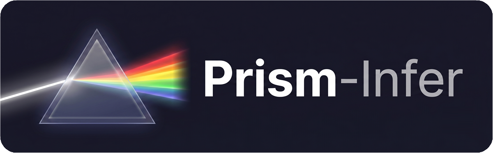

<p align="center">
  
</p>

<h3 align="center">A minimal LLM inference engine</h3>

<p align="center">
  <a href="#features"><b>Features</b></a> &middot;
  <a href="#reference-performance-snapshot"><b>Performance</b></a> &middot;
  <a href="#installation"><b>Installation</b></a> &middot;
  <a href="#quick-start"><b>Quick Start</b></a> &middot;
  <a href="#testing"><b>Testing</b></a> &middot;
  <a href="#benchmark"><b>Benchmark</b></a>
</p>

<p align="center">
  <a href="https://github.com/SparkSnail/prism-infer/actions/workflows/ci.yml">
    
  </a>
</p>

**prism-infer** is a minimal LLM inference engine focused on getting single-instance inference **correct, fast, and memory-efficient**: KV cache management, two-phase scheduling, and Qwen3 MoE/Dense forward.

It started as a fork of [nano-vllm](https://github.com/GeeeekExplorer/nano-vllm) and extends it with **scheduling / state / failure-handling and fencing** mechanisms at the inference engine layer.

In multi-node deployments, `prism-infer` provides the GPU workers that execute prefill and decode and own the KV-cache runtime. [prism-serve](https://github.com/SparkSnail/prism-serve) provides the Kubernetes Gateway and control plane that coordinates those workers.

## Features

- **PagedAttention**: fixed-size KV blocks, prefix caching via rolling hash
- **Two-phase scheduling**: prefill + decode continuous batching with preemption
- **Tensor parallelism**: column/row-parallel linear, fused QKV / gate-up projections
- **Expert parallelism**: all-to-all dispatch/combine for MoE across multiple GPUs
- **CUDA graph**: capture for decode, Torch compilation for fused ops
- **KV cache LRU + CPU offload**: access-order eviction, pinned CPU pool, recall on prefix hit
- **Qwen3 Dense** forward: GQA + QK-norm + RoPE (`theta=1e6`)
- **Qwen3-MoE** forward: router top-k of N + SwiGLU experts with re-norm
- **PD disaggregation**: prefill-only / decode-only engine modes, KV transfer via NCCL P2P
- **KV snapshot and migration primitives**: aligned/unaligned/incremental helpers, three-way handshake, watchdog

## Reference Performance Snapshot

This immutable historical reference measures the end-to-end Prism stack, not
an isolated benchmark of either repository. `prism-serve` applies optional
prefix-affinity routing and coordinates the `prism-infer` prefill/decode
workers. On the recorded model, hardware, topology, request mix, and
concurrency, affinity lowered time-to-first-token and end-to-end latency while
increasing completed-request throughput. The table keeps the decode trade-off
visible. It is a controlled paired benchmark for the fixed 2P2D setup, not a
production SLO or a claim about the current working tree.

**Headline:** With affinity enabled, TTFT p50 is 64.9% lower, E2E p50 is 33.4% lower, and successful request throughput is 35.1% higher on this workload. TPOT rises, so this is a workload-specific prefix-reuse result, not a blanket speedup.

| Benchmark setup | Value |
|---|---|
| Model | Qwen3-8B, BF16 |
| Hardware | 2 nodes, 4 NVIDIA L20 GPUs |
| Parallelism | fixed 2P2D, TP=1 |
| Workload | 512 shared + 257 unique input tokens; 32 output tokens |
| Concurrency | 50 |
| Sampling | streaming; 3 repetitions of 100 warm-up + 250 measured requests (1,050 total per configuration) |
| Transport | NCCL Socket |

| Metric | Affinity OFF (baseline) | Affinity ON | Change vs OFF |
|---|---:|---:|---:|
| TTFT p50 / p95 / p99 (ms) | 6,527.661 / 9,975.492 / 10,729.448 | 2,293.325 / 4,305.316 / 5,522.773 | 64.868% / 56.841% / 48.527% lower |
| TPOT p50 / p95 / p99 (ms) | 25.798 / 29.938 / 31.989 | 81.959 / 145.253 / 151.019 | 217.696% / 385.173% / 372.103% higher |
| E2E p50 / p95 / p99 (ms) | 7,387.104 / 10,750.170 / 11,610.063 | 4,916.720 / 5,442.772 / 5,581.826 | 33.442% / 49.370% / 51.923% lower |
| Successful requests/s | 6.274584 | 8.475600 | 35.078% higher |
| Successful output tokens/s | 200.7867 | 271.2192 | 35.078% higher |

The immutable result record and input provenance are maintained in the
companion [`prism-serve` benchmark archive](https://github.com/SparkSnail/prism-serve/tree/main/bench/results).

## Installation

Runtime support:

- Supported: Linux (Ubuntu), or Windows + WSL2 (Ubuntu)
- Not supported: native Windows Python runtime, macOS

### Environment setup (prerequisites)

The package has two install paths:

- **CPU/control-plane:** installs the Python runtime needed by tests and worker
  protocol tooling. It does not execute model attention.
- **GPU inference:** requires Linux/WSL2, an NVIDIA CUDA runtime, a matching
  PyTorch/Triton pair, and `flash-attn`.

For the GPU stack, install the package first and then install a FlashAttention
wheel matching the selected PyTorch/CUDA/Python/C++ ABI from the
[flash-attention releases](https://github.com/Dao-AILab/flash-attention/releases):

```bash
pip install -e .
pip install "triton>=3,<3.3"
pip install <matching-flash-attn-wheel>.whl
```

The optional `.[gpu]` extra is available when your package index provides a
compatible FlashAttention wheel. Installing FlashAttention from source needs a
CUDA toolkit and `nvcc`, and can take substantially longer.

Verify the environment:

```bash
python -c "import torch; print(torch.cuda.is_available(), torch.version.cuda)"
python -c "import flash_attn, triton; print('ok')"
```

### Install

Same commands on Linux and WSL2 (Ubuntu):

```bash
git clone https://github.com/SparkSnail/prism-infer.git
cd prism-infer
pip install -e ".[test]"
```

Windows users: run the commands above inside a WSL2 Ubuntu shell.

### Docker

The Dockerfile builds the pinned Linux/CUDA worker image and embeds model
provenance. Model files are supplied through a local BuildKit named context;
no model download occurs during the image build. Pass a parent directory that
contains the profile directory, or pass the profile directory itself:

```bash
MODEL_CACHE="$HOME/models"
docker build \
  --build-context model-cache="$MODEL_CACHE" \
  --build-arg PRISM_IMAGE_VARIANT=correctness \
  --build-arg GIT_SHA="$(git rev-parse HEAD)" \
  -t prism-infer:local .
```

For the performance profile, the cache must contain the pinned `Qwen3-8B`
directory instead:

```bash
docker build \
  --build-context model-cache="$HOME/models" \
  --build-arg PRISM_IMAGE_VARIANT=performance \
  --build-arg GIT_SHA="$(git rev-parse HEAD)" \
  -t prism-infer:qwen3-8b .
```

The staging step checks `config.json`, tokenizer metadata, and every
safetensors file against the cache's required
`.prism-model-manifest.json`. The manifest records the model ID, model and
tokenizer revisions, and SHA-256 for each file; a matching
`.prism-model-revision` marker is also required. The build never creates a
marker or silently labels unverified weights as pinned. Create the cache
identity entirely offline after obtaining the model; this command writes both
files:

```bash
python scripts/create_model_cache_manifest.py \
  --model-dir "$HOME/models/Qwen3-8B" \
  --model-id Qwen/Qwen3-8B \
  --revision b968826d9c46dd6066d109eabc6255188de91218 \
  --tokenizer-revision b968826d9c46dd6066d109eabc6255188de91218 \
  --config-sha256 f7c4eadfbbf522470667b797a3c89be2524832d2d599797248dc304fff447c30
```

Keep the model cache outside the application build context so model bytes are
not copied into the source context. A missing or mismatched manifest fails the
build before any image is produced.

For a published image, set `PRISM_RELEASE=true`; the build then rejects an
unknown source revision:

```bash
docker build \
  --build-context model-cache="$HOME/models" \
  --build-arg PRISM_IMAGE_VARIANT=correctness \
  --build-arg PRISM_RELEASE=true \
  --build-arg GIT_SHA="$(git rev-parse HEAD)" \
  -t prism-infer:<release> .
```

### Release tags

The first public container release follows the package version `v0.3.0`:

- `sparksnail/prism-infer:v0.3.0` - the Qwen3-0.6B correctness profile
- `sparksnail/prism-infer:v0.3.0-qwen3-8b` - the Qwen3-8B performance profile

The model-profile suffix is part of the tag because the images contain
different pinned model artifacts. Tags are convenient release aliases; pin the
image digest and matching source commit for a reproducible deployment or a
paired benchmark. Create the Git release tag `v0.3.0` on the same clean source
commit used for the image. Do not use `latest`.

## Model Download

| Model | Type | Use |
|-------|------|-----|
| **Qwen3-0.6B** | Dense | smoke test / Dense path / `example.py` / `bench/bench.py` |
| **Qwen3-30B-A3B** | MoE | exercises the MoE code path via `example.py` / `bench/bench.py --eager` (needs large GPU memory) |

```bash
pip install modelscope   # or use huggingface-cli

# Dense (default)
modelscope download --model Qwen/Qwen3-0.6B --local_dir ~/models/Qwen3-0.6B

# MoE (large, ~60GB BF16)
modelscope download --model Qwen/Qwen3-30B-A3B --local_dir ~/models/Qwen3-30B-A3B
```

## Quick Start

Download a model (see [Model Download](#model-download)), then run the example:

```bash
PRISM_MODEL=~/models/Qwen3-0.6B python example.py
```

`example.py` read the model directory from the `PRISM_MODEL` env var (a local model folder; defaults to `~/models/Qwen3-0.6B/`).

## Testing

**Unit tests run on CPU.**

```bash
pip install -e ".[test]"
python -m pytest tests/ -q
```

The CPU suite covers scheduling, block management, KV transfer, KV snapshot/migration, PD connector logic, distributed context, and tensor/expert parallel math.

**E2E Parity Tests**

The parity tests (single-step and end-to-end token parity vs HuggingFace) need a CUDA GPU, flash-attn, and a local model. They are skipped unless `PRISM_TEST_MODEL` points to a local model directory:

```bash
PRISM_TEST_MODEL=~/models/Qwen3-0.6B python -m pytest tests/ -q
```

**MoE E2E Parity Tests**

MoE-specific tests use a separate env var so they don't interfere with the Dense test suite. Run them after the standard suite, not together:

```bash
# Single-GPU MoE forward + scheduler parity (needs >=40 GB VRAM)
PRISM_TEST_MOE_MODEL=~/models/Qwen3-30B-A3B python -m pytest tests/test_parity_moe_e2e.py -v

# EP=2 logits parity (needs >=2 GPUs; run after the above to avoid OOM)
PRISM_TEST_MOE_MODEL=~/models/Qwen3-30B-A3B python -m pytest tests/test_parity_ep.py -v
```


## Benchmark

`bench/bench.py` measures **TTFT**, **prefill throughput**, **decode TPS**, and a **throughput-vs-batch-size** curve, for both Dense and MoE models.

Pass `--model` (or set `PRISM_MODEL`) and use `--seed`, `--repetitions`, and
`--output path.json` for reproducible runtime reports. The separate
`bench/tp_parity.py` script is a TP correctness diagnostic, not a performance
benchmark.

See the [benchmark guide](bench/README.md) for command examples, metric
definitions, structured output, and multi-GPU notes.

## License

[MIT](LICENSE)
